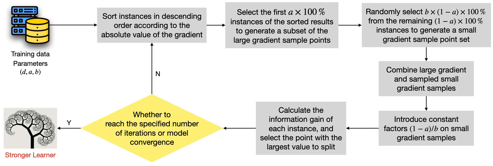

# BoostingWithGoss
This repo holds an implementation of Gradient Boosting Decision Tree which aims to reproduce the Gradient one-side sampling technique presented in LightGBM

Light gradient boosting machine (LightGBM) is an integrated algorithm for building gradient boosting decision tree(GBDT), which has the characteristics of faster training speed, lower memory consumption, better accuracy, and support for parallel processing of massive data. Different from traditional algorithms for generating GBDTs, such as XGBoost, pGBRT, scikit-learn, etc.

## Gradient-based One-Side Sampling (GOSS)

GOSS mainly realizes data sampling. Since large gradients amples have a greater impact on information gain, GOSS discards samples which are not helpful in calculating information gain. When data sampling is performed, only large gradient instances are retained, and small gradient instances are randomly sampled while introducing constant multipliers (1−a)/b, leading to make the algorithm pay more attention to the instances of insufficient training and reduce the impact on the distribution of the original dataset.

Since this code is not for production, it is not optimized for speed and memory usage.
